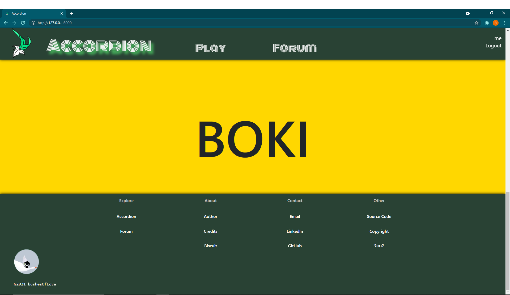
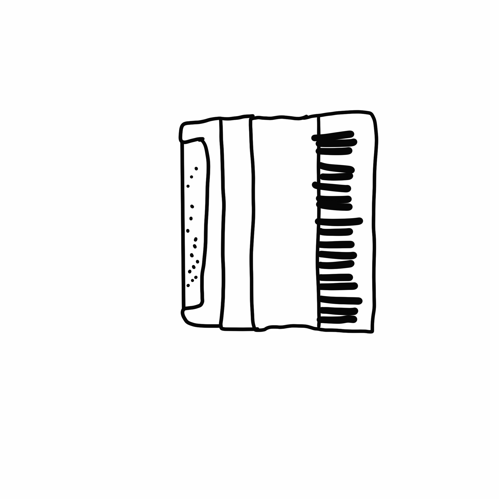

# Journal

This is a journal to keep track of the production of this website. 

I doubt that anyone's gonna read it.

Starting at *August 13th, 2021*

***Day 1***

Made a layout.html. It looks fantastic, while the CSS behind is messy. It's like you see a fairy, but when no one's watching, it goes to the toilet too, and it's not like it evacuates rainbow.

You know, I am a pretty decent illustrator. I illustrated the logo, and I made the background of it to be transparent. I will also be the one illustrating the animations of the accordion. To sum up, I'll do literally everything, and that's not figurative. 

By the way I had this accordion website idea since a long time ago, and it's fun to finally implement it.

***Day 2***

All of my work from day 1 are gone. Damn it. I deleted it after trying to "git add ."
while the folder venv is in the directory. Then after a series of clicking with poor judgement, they're all gone. 

I spent two hours building them again. I am not angry at all.

What I have now is a working account registration website. You can register, log in, and log out. The website looks great, you know, my layout is cool, and my font choice. Though my CSS skills aren't great, my design skills are.

Next step: Look into SVGs. Get a functioning index page. Afterwards, update models.py and allow forums. Experiment with more GIF-like thingys to obtain the desired functionality.

At the end of today, I tried to make an animation by rapidly swapping images. Though
it has occured to me that JS does not allow infinite loops. In addition, the setTimeOut() function does not work as expected. The browser kept freezing. Then I did an extensive research on the internet, and found that making animations by swapping images is a technique used 10-15 years ago, according to stack overflow user *serraosays*, and this person said this six years ago, in 2015. Well, I guess I'll have to experiment on SVGs instead.

I had an epiphany! I could manipulate the feature of an accordion's squeezebox to make the JS process simpler! Re-initialize after a set, heck, half a set! This is a brilliant idea! Not only does it make my life simpler, but it also simulates a more realistic accordion-playing experience.

***Day 3***

Okay, GIFs doesn't work. The x-gif extension thing isn't responding. Very frustrating, this is. I'm going to try sprite sheets next.

Great, it seems like sprite is a really promising solution here. First, make a GIF using procreate. Then convert that GIF to Sprite Sheet, and voila! See *"experimentSPRITE.html"* that is archived. Now I'm going to make a complete animation of accordion. I'm going to take pictures of my own accordion, and then draw it on procreate.

Accordion website, I want to tell you that, daddy's proud of you XD. You look stunning. Let me add an image so that you can see how great it looks like.

Hmm, I guess if you actually have that on your screen it would look better.

***Day 4***

Today, I did nothing but to make the animation of the accordion. I made a GIF, 26 frames. It is a piece of work, but I am happy with the outcome.

From

To

***Day 5***

Today is a miserable day. I spent five hours trying to figure out how to use the sprite thing, but no luck. I even downloaded npm to convert stuff. Still no luck.

I asked a friend, OP, who writes posts and tutorials about web development using python, django, etc, about web animations, but sadly he doesn't have any contructive suggestion.

MAN! Finally. This pain in the ass sprite. If there's one thing I learned from spending all these hours today, don't use stupid sprite-ing tools that doesn't give you the matching CSS. Don't use Sprite cow if your sprite comes from a crappy sprite-ing website. DO IT YOURSELF! Do it in Photoshop.

I'm making real progress here. See *expSprite2.html*, which is archived (well, still some changes will be applied).

I tried R-SWAP (rapidly swapping images using JS), SVG, GIF, but I eventually landed on Sprite.

Not to brag, but after so many research and experiments, I'm a bit of a sprite expert myself now. I'm gonna add that to my LinkedIn page.