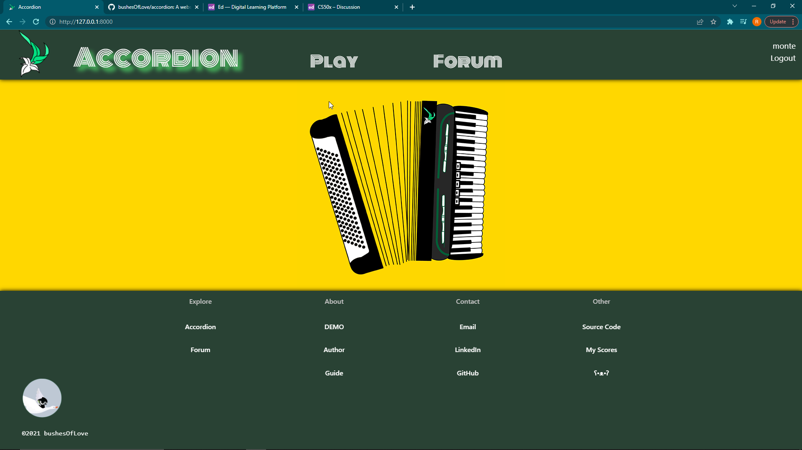
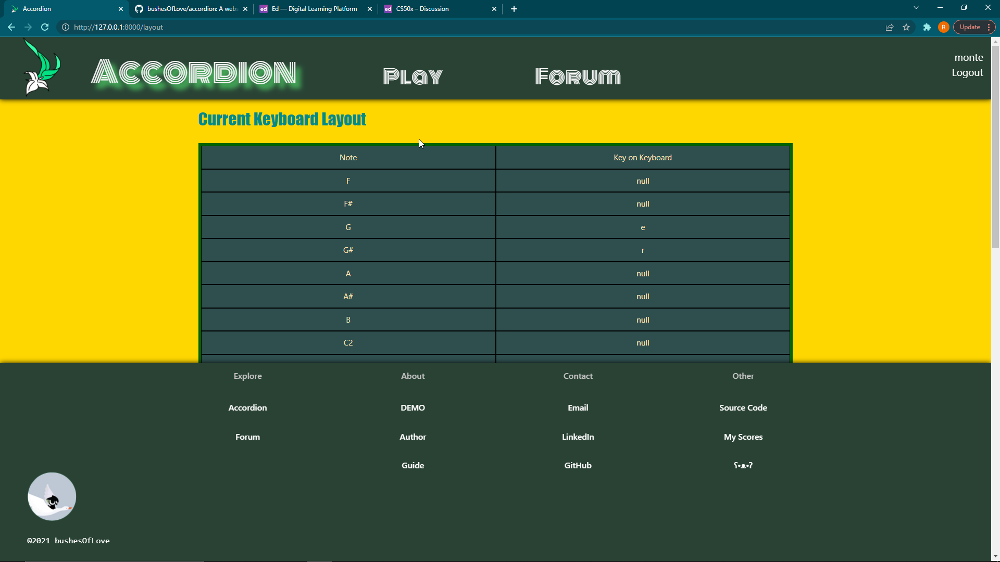
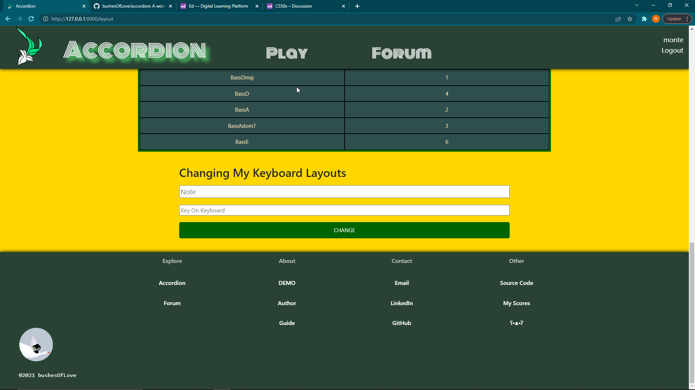
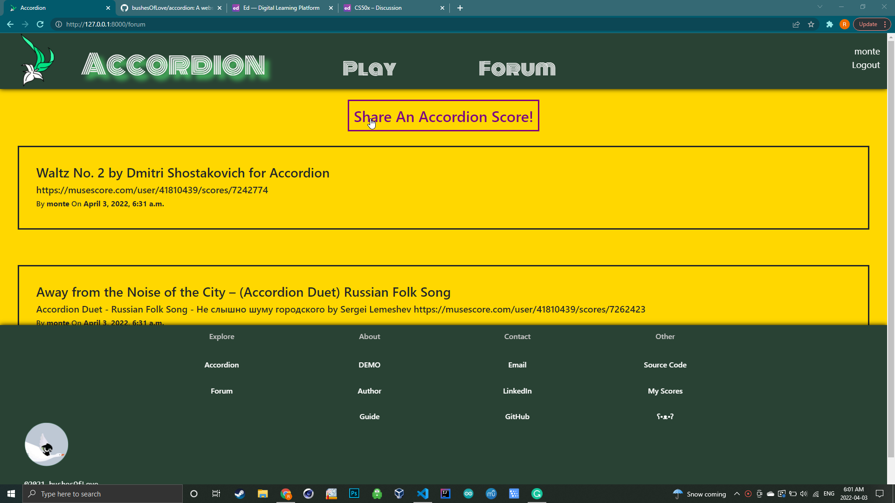

# Accordion - CS50 Web Capstone

### Demo: https://www.youtube.com/watch?v=ea7JUgMw4Fs

## Distinctiveness and Complexity
- Animation/Sprite + JS
    - The animations I've applied for the accordion are simply astonishing. I illustrated the accordion based on mine. I also drew many frames so that it is animated. However, that's not the most impressive part. In order to accomplish the responsive animation, I had to research a whole new area of JS. There are several potential ways to implement the effect that I want—accordion plays when the key is being pressed and stops immediately when the key is up—such as R-SWAP (rapidly swapping images using JS), SVG, and GIF, but I finally reached a perfect solution to my problem, which is using the sprite method. I experimented with the method and compiled the sprite on Adobe Photoshop. Finally, I got it to work. The level of self-studying and perseverance can be rated as sprite god out of ten.
- Audio Engineering
    - When I tried to implement the audio into my web app, little did I know about the utmost fear of mp3's, which is that it inevitably has a gap in the start and the end due to the compression of the file. It is the unavoidable, the inevitable, the abibidable. However, I found a way to work around it, which is to use longer files. I recorded my accordion while I intricately controlled the squeezebox and engineered the crap out of this audio, not to mention the extremely efficient JS code in the index.html file, which initiates instances of audio in a dictionary.
- Customizable Keyboard Layout
    - Everyone has their preferred way to maneuver and navigate the keyboard, which is why I implemented the feature of letting the user choose their own keyboard layout—they get to decide which key produces which note. Implementing this feature isn't easy at all. This feature requires me to combine the model in Django with Javascript in an interesting way. I had to refer to the attributes in models, not explicitly. Thankfully I found a way to do it, which is using getattr() and setattr(). In the models for the keyboard layout (models.py), each user has a default setting of layout, which they could change. When there's a collision of values, the override key would automatically be null, avoiding the problem of identical elements in a dictionary. Furthermore, I utilized the Foreign key, which is pretty standard, to refer to the user who sets the layout, so that every user can have their own customized layout.
- Internation between Django Model and JS (JSON File)
    - Like I said in the previous point, I had to combine the model with JS. To do so, I did decent research and dumped the information into a JSON file in manage.py before handing it to the template. Furthermore, I implemented the reverse of dictionaries while keeping in mind the identical elements' predicament.
- Stradella Bass System
    - "The Stradella Bass System is a buttonboard layout equipped on the bass side of many accordions, which uses columns of buttons arranged in a circle of fifths; this places the principal major chords of a key in three adjacent columns." — Wikipedia. In my opinion, the Stradella bass is the soul of the accordion. This is why I added the Stradella bass in the notes available, including D major chord, D, A, E, and A dominant 7th chord.
- Admirable UI
    - If you could just look at this layout, this geometry, this dynamic, this collision and symbiosis of color... That's the way to go, right?
- Accordion's Squeezebox Feature
    - Accordion's squeezebox is the soul of the accordion. When you change direction of the squeezebox, the sound stops, which is why accordionists must plan their squeezebox in an intricate way as to not interrupt the melody. This is why each note as I set, can only last for around 15 seconds, allowing the users to plan their squeezebox, embracing the art of the accordion
- Discussion Forum
    - I am so glad that you read so much of my poppycock. I'll say more. In the discussion forum, accordionists can share their favourite scores, which is awesome. When you go look for scores, they're all for the piano; aw, screw the piano: they have too much scores and i'm jealous. This is why accordionists must share scores to make sure every accordionist gets scores. This is why I made this function. This is awesome. Caring is Sharing out of ten.

## How to run

I built this in an virtual enviornment that I only pip installed Django, so if you have Django installed, you can simply run python manage.py runserver in /music/. Check requirements.txt for more information.

## What's in each file?

Inside of the static folder there's audio files, sprite, favicon, and my logo. Inside of the templates file there's templates. Templates are inside of the templates file. Files that are not template files are not inside of the templates file. Inside of the experiments folder there's experiments I've performed in the development process that you can just ignore. In the Journal lies my suffering in the development process. 

Screenshots:

